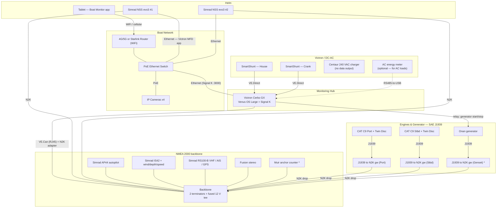
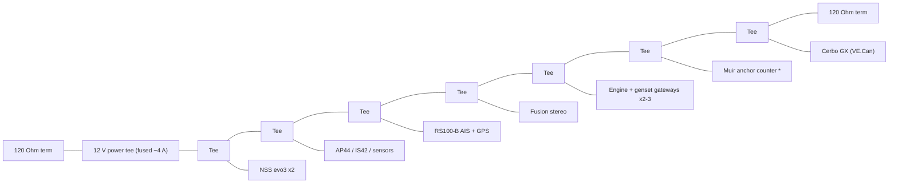
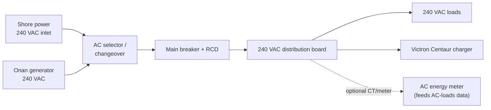
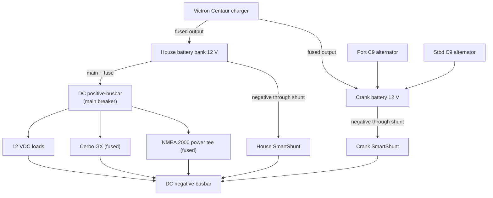

# Wiring, Power & Bill of Materials

How the monitoring hardware connects so that all data reaches the **Signal K
server** on the Cerbo GX and, from there, the **Boat Monitor** app on the tablet.
GitHub renders the Mermaid diagrams below automatically.

> This is a **monitoring/architecture reference**, not an electrical installation
> drawing. Follow ABYC / AS-NZS wiring standards, fuse every positive conductor at
> its source, and have AC and high-current DC work done or checked by a qualified
> marine electrician.

## Equipment on board (this vessel)

| System | Equipment | Data path |
|---|---|---|
| Propulsion | 2× **Caterpillar C9** + **Twin Disc** gearboxes | SAE J1939 → gateway → NMEA 2000 |
| Generator | **Onan** genset | J1939 → gateway → NMEA 2000 (if equipped); start/stop via Cerbo relay |
| MFDs | 2× **Simrad NSS evo3 12"** | NMEA 2000 + Ethernet (Victron MFD app) |
| Autopilot | **Simrad AP44** | NMEA 2000 |
| Instruments | **Simrad IS42** + wind/depth/speed | NMEA 2000 |
| VHF / AIS | **Simrad RS100-B** (AIS + internal GPS) | NMEA 2000 |
| Windlass | **Muir** anchor winch + chain counter | NMEA 2000 windlass PGNs *(verify counter output)* |
| Entertainment | **Fusion** stereo | NMEA 2000 |
| Monitoring hub | **Victron Cerbo GX** (Venus OS Large + Signal K) | VE.Can ↔ NMEA 2000, VE.Direct, Ethernet |
| Battery monitors | 2× **Victron SmartShunt** | VE.Direct → Cerbo |
| Charging | **Victron Centaur** 240 VAC charger | **no data output** (see notes) |

## Data / NMEA 2000 system overview

`*` The **genset J1939 gateway** and **Muir chain-counter** integration depend on
whether those units expose the data (see notes).

## NMEA 2000 backbone topology

Linear backbone, short drops (≤ 6 m) to each device, a **120 Ω terminator at each
end**, and **one** fused 12 V power tee. The Cerbo joins via its **VE.Can** port
set to 250 kbit/s NMEA 2000.

## Power one-line — AC (240 V)

## Power one-line — DC (12 V)

**SmartShunt rule:** the shunt goes in the **battery-negative** path so *all*
current in/out of that bank passes through it. Nothing connects to the battery
negative post except the shunt; everything else lands on the negative busbar.

## Connection reference (device → app)

| Device | Connection | Cable / bus | App section / Signal K |
|---|---|---|---|
| Tablet | WiFi router | WiFi / cellular | whole UI |
| IP cameras ×4 | PoE switch | Ethernet (PoE) | **Cameras** |
| NSS evo3 ×2 | N2K + Ethernet | Micro-C + Cat5e | source of nav data; can also show Victron via MFD app |
| AP44 autopilot | N2K backbone | Micro-C | Navigation (heading/course) |
| IS42 + sensors | N2K backbone | Micro-C | Navigation, Wind, depth |
| RS100-B VHF/AIS | N2K backbone | Micro-C | **AIS** targets, GPS position |
| Muir anchor counter | N2K backbone * | Micro-C | Anchor rode (windlass PGNs) |
| Fusion stereo | N2K backbone | Micro-C | (not shown; available in Signal K) |
| CAT C9 Port | J1939 → gw → N2K | J1939 CAN | Engine `propulsion.port` |
| CAT C9 Stbd | J1939 → gw → N2K | J1939 CAN | Engine `propulsion.starboard` |
| Onan genset | J1939 → gw → N2K *; relay from Cerbo | J1939 + relay | **Generator** `electrical.generators.onan` |
| House SmartShunt | Cerbo VE.Direct | VE.Direct | House Battery Bank + 12 VDC loads |
| Crank SmartShunt | Cerbo VE.Direct | VE.Direct | Crank Battery Bank |
| AC energy meter (add) | Cerbo RS485-USB | RS485 | **240 VAC Loads** `electrical.ac.consumption` |
| Cerbo GX | Ethernet + VE.Can | Cat5e + N2K adapter | serves the app; ingests everything |

## Bill of materials

Quantities assume adding the monitoring hub + engine/genset data to an existing
Simrad NMEA 2000 network. **Verify what's already installed** before ordering.

| # | Item | Example part | Qty | Purpose |
|---|---|---|---|---|
| 1 | J1939 → NMEA 2000 engine gateway | Yacht Devices YDEG-04 (or Maretron J2K100) | **2** | CAT C9 Port & Stbd engine data; set engine **instance** per side |
| 2 | J1939 → NMEA 2000 gateway (genset) | Yacht Devices YDEG-04 | 1 * | Onan engine data *if* the controller exposes J1939 |
| 3 | VE.Can → NMEA 2000 cable | Victron ASS030520200 | 1 | Cerbo VE.Can to the N2K backbone |
| 4 | N2K Micro-C T-connectors | Any NMEA 2000 tee | 4–6 | one per added device (gateways, Cerbo, meter) |
| 5 | N2K Micro-C drop cables | 0.5–2 m | 4–6 | gateway/Cerbo drops |
| 6 | N2K backbone extension + terminators | Micro-C cable + 2× 120 Ω | as needed | if extending the backbone ends |
| 7 | N2K power tee (fused) | powered tee + 4 A fuse | verify 1 | single power insertion point |
| 8 | SimNet → Micro-C adapters | Navico adapter cable | as needed | only if any legacy SimNet ports remain |
| 9 | AC energy meter + interface | Victron ET112 + RS485-to-USB | 1 (optional) | **populates the 240 VAC Loads panel** (Centaur can't) |
| 10 | VE.Direct cables | Victron VE.Direct | 2 | SmartShunts → Cerbo (usually included with the shunt) |
| 11 | Cerbo GX 12 V supply | fused feed + inline fuse | 1 | power the Cerbo from the house bank |
| 12 | Generator start/stop wiring | 2-core to genset remote-start; use a Cerbo relay | 1 | remote start/stop from the app (verify interlocks) |
| 13 | 4G/5G or Starlink router | marine router | 1 | internet for weather/tides + WiFi for the tablet |
| 14 | PoE Ethernet switch | marine/industrial PoE switch | 1 | powers/links the cameras + Cerbo |
| 15 | IP cameras | MJPEG/HLS or ONVIF PoE cameras | up to 4 | **Cameras** tab |
| 16 | Tablet + helm mount | marine tablet + RAM mount | 1 | runs the app |

`*` Optional / conditional — see notes.

## Notes specific to this boat

- **240 VAC loads need a meter.** The **Centaur** is a charger with no data
  output, so nothing reports AC consumption today. Add a Victron energy meter
  (item 9) on the AC load side to feed the **240 VAC Loads** panel — otherwise it
  stays blank. (The Centaur's charging still shows up indirectly: charge current
  into the house bank appears on the house **SmartShunt**.)
- **No solar.** There's no MPPT, so the **Solar · MPPT** card will be empty. I can
  hide it in the app — just say the word (or leave it, it simply shows `--`).
- **Engines are J1939.** The C9s (and the genset, if equipped) need a
  **J1939→NMEA 2000 gateway** each; set the gateway **engine instance** so Signal
  K maps them to `propulsion.port` / `propulsion.starboard` and the generator.
  Twin Disc gearbox data (oil pressure/temp) is only available if the transmission
  control system publishes it — otherwise the gearbox shows on its own display.
- **Simrad + Victron on the MFDs.** The 2× NSS evo3 can also display the Cerbo's
  Victron data via Venus OS's built-in **Marine MFD (HTML5)** app over Ethernet —
  no extra hardware, just put the Cerbo and MFDs on the same network and enable it.
- **Muir anchor counter.** If the Muir controller outputs NMEA 2000 windlass PGNs
  the rode/chain count appears in Signal K; if not, it stays on its own counter
  display (or needs a rode-counter-to-N2K interface).
- **Onboard hosting.** Serve the app from the Cerbo (or a boat LAN server) over
  `http://` so it can reach Signal K and LAN cameras without HTTPS mixed-content
  blocking — see the README "Onboard hosting" note.
