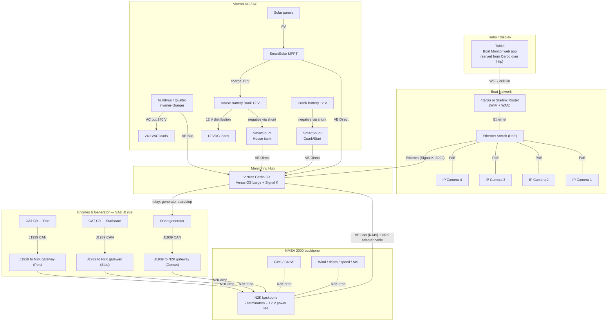
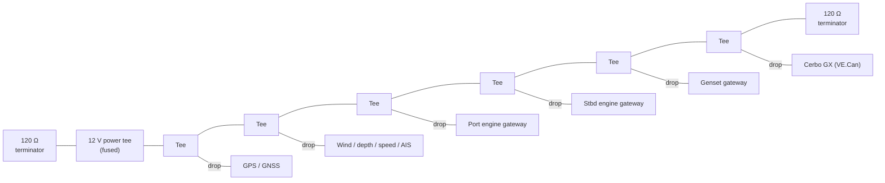

# Wiring & System Diagram

This shows how the monitoring hardware connects so that all the data reaches the
**Signal K server** on the Cerbo GX and, from there, the **Boat Monitor** app on
the tablet. GitHub renders the Mermaid diagrams below automatically.

> This is a **reference/monitoring wiring overview**, not an electrical
> installation drawing. Follow ABYC/AS wiring standards, fuse every positive
> conductor at the source, and have AC and high-current DC work done or checked
> by a qualified marine electrician.

## System overview

## NMEA 2000 backbone (topology detail)

NMEA 2000 is a **linear backbone** with short drop cables (≤ 6 m) to each device,
a **120 Ω terminator at each end**, and **one** 12 V power insertion point (fused,
via a power tee). The Cerbo GX joins it through its **VE.Can** port using a
VE.Can-to-NMEA2000 adapter cable.

## Connection reference

| Device | Connects to | Cable / bus | Feeds app section |
|---|---|---|---|
| Tablet | WiFi router | WiFi (or cellular) | the whole app UI |
| IP cameras ×4 | PoE switch | Ethernet (PoE) | **Cameras** tab |
| WiFi router | Ethernet switch → Cerbo | Ethernet | transport for Signal K :3000 |
| Cerbo GX | NMEA 2000 backbone | **VE.Can** (RJ45) + N2K adapter | ingests all N2K data |
| GPS / GNSS | N2K backbone | N2K drop | Navigation, position, tides/weather location |
| Wind / depth / speed / AIS | N2K backbone | N2K drop | Navigation, Wind, AIS tabs |
| CAT C9 **Port** | J1939 → gateway → N2K | J1939 CAN | Engine panel `propulsion.port` |
| CAT C9 **Starboard** | J1939 → gateway → N2K | J1939 CAN | Engine panel `propulsion.starboard` |
| Onan generator | J1939 → gateway → N2K (data); relay from Cerbo (start/stop) | J1939 CAN + relay | **Generator** panel `electrical.generators.onan` |
| House **SmartShunt** | Cerbo VE.Direct | VE.Direct | House Battery Bank + 12 VDC loads |
| Crank **SmartShunt** | Cerbo VE.Direct | VE.Direct | Crank Battery Bank |
| SmartSolar **MPPT** | Cerbo VE.Direct | VE.Direct | Solar · MPPT |
| MultiPlus / Quattro | Cerbo VE.Bus | VE.Bus | 240 VAC loads `electrical.ac.consumption` |

## Key wiring notes

**NMEA 2000**
- Two 120 Ω terminators (one at each backbone end) and exactly **one** 12 V power
  tee, fused (typically 3–4 A).
- Keep drop cables short; total backbone length and device count within N2K limits.
- On the Cerbo, set the **VE.Can** port to **250 kbit/s VE.Can & NMEA 2000** and
  connect the N2K backbone there (see the Venus OS Large setup guide).

**Engines & generator (SAE J1939)**
- CAT C9 engines and many gensets speak **J1939**, *not* NMEA 2000 directly — each
  needs a **J1939-to-NMEA 2000 gateway** (e.g. Yacht Devices YDEG-04, Maretron
  J2K100). Set each gateway's **engine instance** so Signal K sees them as
  `propulsion.port`, `propulsion.starboard`, and the generator.
- Take J1939 from the engine's data/diagnostic connector — do **not** splice into
  the ECU harness. Confirm the engine's J1939 bus is terminated per CAT's spec.
- Generator **start/stop** uses a Cerbo GX relay into the genset's remote
  start circuit; confirm safe-to-start interlocks before enabling remote start.

**Victron / DC**
- SmartShunts install on the **battery negative** (all loads/charge sources return
  through the shunt). House shunt = house bank, crank shunt = start battery.
- The Cerbo GX has **3 VE.Direct ports** — house shunt + crank shunt + MPPT fill
  them. If you add more VE.Direct devices, use VE.Direct-to-USB on the Cerbo.
- Fuse the Cerbo's 12 V supply and the N2K power tee at the source.

**Network / app**
- For live use, **serve the app from the Cerbo (or a boat LAN server) over
  `http://`** so it can reach Signal K (`ws://`) and any `http://` LAN cameras
  without browser mixed-content blocking. See the README "Onboard hosting" note.
- Cameras on the PoE switch keep their video on the LAN (no cellular data).

---

*IDs used above (`house`, `starter`, `pv`, `onan`, `port`, `starboard`) match the
defaults in the app's Settings — change them there if your gateways/monitors use
different Signal K instances.*
